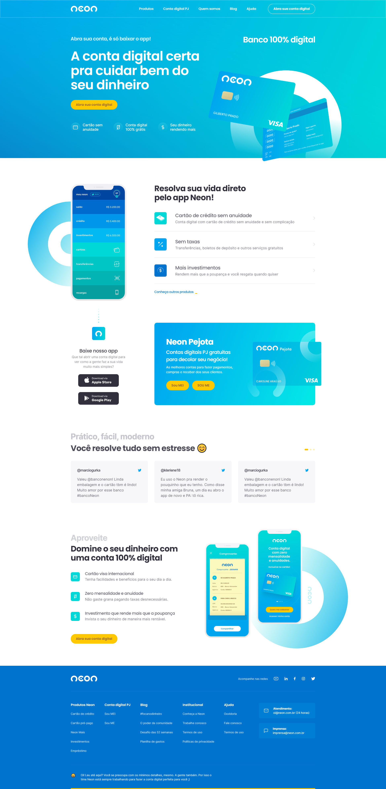

# Projeto NEON

Redesign do Banco NEON, utilizamos 2 bibliotecas para fazer animações e keyframes para controlar 
a etapas intermédiarias em uma sequência de animações CSS.

## Stack utilizada

**Front-end:** HTML, CSS, SASS e JS

**Back-end:** Nenhum

## Funcionalidades

- Responsive
- Otimizado

## Screenshots

## Autor e Criador(CodeBoost)

- [@WillMoreiraDev](https://www.github.com/WillMoreiraDev)
## 🔗 Links

